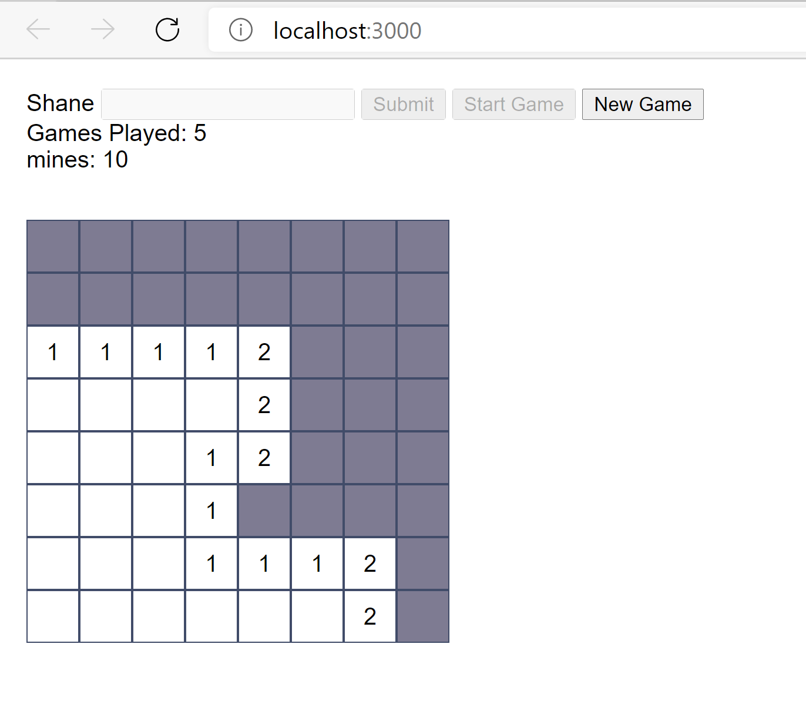
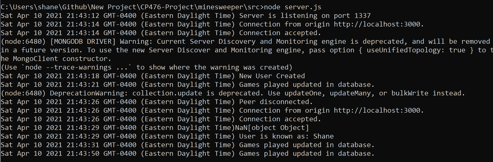
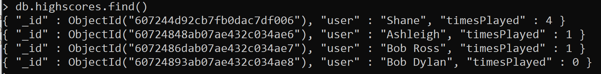
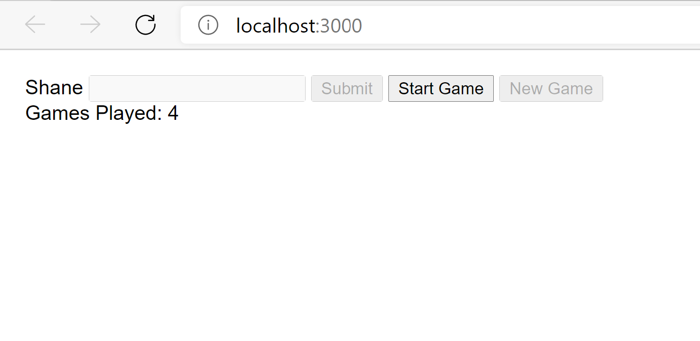
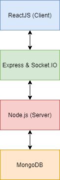
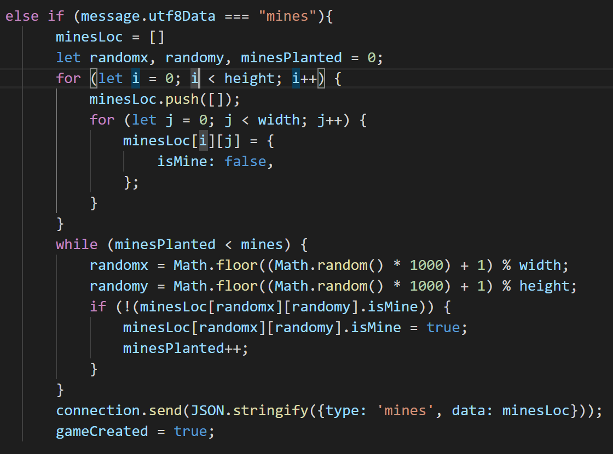

System Design and Implementation
--------------------------------

1.  Client side component & UI

    The client user interface includes the ability to provide your name,
    start the game, and start a new game.

    In the actual game itself, the user can interact with an 8 x 8 grid
    of buttons. Both by right and left clicking. Left clicking checks to
    see if there is a bomb in that button. If there is, the user is told
    that the game is over. If there isn't, the user is told how many
    bombs are in proximity to that button.

    {width="400px"}

2.  Server side CGI components

    The server side creates the puzzle for the user and keeps track of
    their username and games played through the mongoDB. Connection with
    the server happens when the client UI is started. There are multiple
    messages sent and from the server: a. Name: The client sends the
    username to check if the username exists. We go into more detail
    below. b. Mines: The server sends back mines randomly spread through
    the board. This is done server side to avoid too much heavy
    processing on the client side. c. New Game: Tells the server that
    the user has started a new game. The server increments the amount of
    games played by 1 in the mongodb.

	{width="400px"}

3.  Database tier design, data, usage The database holds list of all the
    users it has seen and the amount of games they have played.

    {width="400px"}

    When the user submits their name, it is sent to the server. The
    server checks to see if the username exists. If the username exists,
    it returns the username and the number of times they played the game
    to the client. If the username does not exist, it inserts the
    username and 0 into the database and returns it to the client as
    well.

    The client then displays the amount of games played to the user.
    Everytime the user plays a new game, the server increments the
    amount by one in the database.

    {width="400px"}

4.  New features and tools

    The minesweeper game now relies on a websocket server to function.
    The server now allows for multiple connections from different users.
    The game also has a mongodb database to keep track of users and the
    amount of games they have played. Using react to render different
    components inside other components. Rather than than just having
    everything essentially static with in the html. This allows for
    easier changes and creates a dynamic user interface.

    {width="150px"}

5.  Problem solving algorithms
    a.  The major computing problem that we solved for our project is
        the ability for a user to connect to the server of our
        Minesweeper application, in order to set up and play the game
        and have their username and number of plays tracked in our
        database. We solved for the ability for the client and server to
        connect with one another - the client will create the
        Minesweeper board and its cells (both are rendered as separate
        React components), but the server is responsible for determining
        the location of the mines. We solved for the ability for the
        client and server to pass this information to one another as
        needed.
    b.  Finally, we solved for the ability to use a MongoDB database to
        display information on the client-side. We solved for the
        ability for the server to communicate with the MongoDB database
        based on information passed from the client to the server, and
        for the server to pass MongoDB database information to the
        client in order to render how many times the user has played
        already, add their nickname to the database if it does not
        already exist, and increment the count of how many times they
        have played the game if their nickname already exists in the
        database.
    c.  Our data collection requirements will include collecting a
        user's nickname, which they set for themselves before starting
        the game. We use this information to display to the user how
        many times they have played the game previously, depending on
        whether or not their nickname already exists in our database. We
        will also collect data regarding game status (whether a game is
        completed or not) in order to display winning and losing
        messsages to the users. Additonally, we use ReactJS in order to
        represent our Minesweeper board data to the user.
    d.  To solve the computing problem of creating a Minesweeper game
        with a randomized board for each playthrough, one of the key
        algorithms we need is an algorithm to create and randomize the
        Minesweeper board for the player. The algorithm that the server
        uses to achieve this focuses on randomizing the location of the
        mines - we start by creating a 2D array that essentially
        represents the square Minesweeper board, which is 8x8. We also
        keep track of the number of mines that have currently been
        planted on the board - the maximum number of mines that can be
        planted is 10. While we have not yet planted 10 mines on our
        "board" (in our 2D-array), we select a random number between 0
        and 8 twice to represent the x and y-coordinate. If there is no
        mine at this coordinate, a mine is planted there, and we
        increment the number of mines that have currently been planted
        by 1. Once this algorithm has been run, the 2D-array is passed
        to client, wihch is then used by the Board component to render
        the board for the user. By generating random Minesweeper boards,
        we can ensure that the players are not playing the same
        Minesweeper board multiple times. Below is a screenshot of our
        mine randomization algorithm:

    {width="400px"}

6.  Efficiency and robustness

    a.  To keep the program light weight and efficient, we used react to
        compartmentalize our program. That way when a change is needed
        to be made to the HTML we did not need to reload the entire
        webpage but only the small component of it.
    b.  We also gained effiency by using the jquery functionality. It is
        able to simplify the programs DOM traversal in communications
        between the client and server. Otherwise this would be a bulky
        process that takes up large amounts of processing time.
