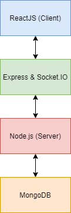

## Introduction

Our project is a web-based application of the classic puzzle game Minesweeper. The game will allow a player to set a nickname for themselves, and then play a game of Minesweeper on the client-end, while a back-end server is responsible for randomizing mine locations. A back-end database keeps track of how many times a specific user has played the game and displays this count to the user.

The game of Minesweeper involves clearing a board that contains hidden mines without setting any of them off. In order to do this successfully, clues are given on the board for the number of mines in proximity to a particular location. 

Our project is to focus on developing our understanding of websocket-based applications. This will allow a client and a server program to communicate with one another in order to solve a problem for the end user. We are interested in addressing the problem of using a back-end server to set up components of a web-based game, and pass this information to the client in order to display the game to the user, and we chose to solve our problem by replicating Minesweeper for our project. 

Another key focus of our project is to improve our understanding of ReactJS. React is a Javascript library this is used for building user interfaces. We are interested in addressing the problem of using React to create a front-end user interface, and then connecting this interface with a back-end server and a database. Once again, we chose to solve our problem with replicating Minesweeper for our project, and using a back-end server and database in combination with React in order to deliver a full-stack web application for our end users.
 
 
## Problem solving and algorithms

The major computing problem that will need to be solved for our project is the ability for a user to connect to the server of our Minesweeper application, in order to set up and play the game and have their username and number of plays tracked in our database. We will need to solve for the ability for the client and server to connect with one another - the client will create the Minesweeper board and its cells (both are rendered as separate React components), but the server is responsible for determining the location of the mines. We need to solve for the ability for the client and server to pass this information to one another as needed. 

Additionally, we need to solve for the ability to use a MongoDB database to display information on the client-side. We will need to solve for the ability for the server to communicate with the MongoDB database based on information passed from the client to the server, and for the server to pass MongoDB database information to the client in order to render how many times the user has played already, add their nickname to the database if it does not already exist, and increment the count of how many times they have played the game if their nickname already exists in the database.

1. Our data collection requirements will include collecting a user's nickname, which they set for themselves before starting the game. We will use this information to display to the user how many times they have played the game previously, depending on whether or not their nickname already exists in our database. We will also collect data regarding game status (whether a game is completed or not) in order to display winning and losing messsages to the users, as well as user nicknames and the number of times they have played our Minesweeper game previously. We will be using MongoDB for our data storage needs. Additonally, we will be making use of ReactJS in order to represent our Minesweeper board data to the user. 
2. To solve the computing problem of creating a Minesweeper game with a randomized board for each playthrough, one of the key algorithms we will need is an algorithm to create and randomize the Minesweeper board for the player. The algorithm that the server uses to achieve this focuses on randomizing the location of the mines - we start by creating a 2D array that essentially represents the square Minesweeper board, which is 8x8. We also keep track of the number of mines that have currently been planted on the board - the maximum number of mines that can be planted is 10. While we have not yet planted 10 mines on our "board" (in our 2D-array), we select a random number between 0 and 8 twice to represent the x and y-coordinate. If there is no mine at this coordinate, a mine is planted there, and we increment the number of mines that have currently been planted by 1. Once this algorithm has been run, the 2D-array is passed to client, wihch is then used by the Board component to render the board for the user. By generating random Minesweeper boards, we can ensure that the players are not playing the same Minesweeper board multiple times. Below is a screenshot of our mine randomization algorithm:

{width=400px}

## System Design

1. System Design
	a. Use Case: The program will only let one users connect to the game and the program must wait until the user has set their nickname before starting. The game will run until the users have won, lost or have disconnected.
	b. Constraints: To prevent too many connections to the server, we have limited the server so only one user can connect at a time.

2. Functional Requirements
	a. User should be able to connect to the application and enter a nickname.
	b. User will be able to connect to to the server and see how many times they have played the game previously, if applicable.
	d. The system will generate a random Minesweeper board for the user.
	f. When the user clicks a square on the board, they will get a number, which is the number of how many mines are surrounding the square.
	g. If a user clicks on a cell that has a mine, their game will end and the other player will win.
	h. If a user right-clicks on a cell on the board, a flag will be placed. This flag allows the user to mark critical information to help them succeed, such as locations of mines.
	i. When the user wins or loses, the game will stop and the application will tell the user whether they have won of lost depending on the scenario.

3. Non-functional Requirements
	a. The system must be able to connect a user to the server, unless there is already a usre connected.
	b. The system's performance should ensure that the user is not waiting a long time between starting the game and the rendering/development of the Minesweeper board.

4. Project Architecture

	{width=150px}

5. Tools for project
	a. ReactJS: Creates a GUI for the user to interact with and send/receive requests to/from the server.
	b. MongoDB: Houses IPs and usernames of its guests as well as the top fastest times to be displayed on the highscore board.
	c. Express: A helper program to help create the web application and fill in the gaps of Node.js.
	d. Socket.IO: A program that makes communication between the client and server simple.
	e. Node.js: Will handle server side functionality and will be responsible for most of the game's processing.
	f. jQuery: Used to simplify DOM traversal in communications between the client and server. 

## Milestones & schedule

Below is a table of tasks, milestones, and check points for our multiplayer Minesweeper group project, along with a schedule of when these activities will be completed.

| Task ID | Description   |  Due date | Lead   |  
| :----:  | :------------ | :-----:   | :------: |  
|  1      | Project research & team up | Day 5 of week 9 | Shane Haalstra  Ashleigh Stroud | 
|  2      | Project proposal | Day 1 of week 10 | Shane Haalstra and Ashleigh Stroud |
|  3      | Project check point - create single-player Minesweeper game (no multiplayer at this time) | Day 6 of Week 10 | Ashleigh Stroud  |
|  4      | Project check point - integrate multiplayer   | day 6 of Week 11  | Shane Haalstra |
|  5      | Project demonstration | Day 5 of week 12 | Shane Haalstra and Ashleigh stroud  |
|  6      | Project submission | Day 5 of week 13 | Shane Haalstra and Ashleigh Stroud  |

## References

1. [Modernweb - Building Multiplayer Games with Node.js and Socket.IO](https://modernweb.com/building-multiplayer-games-with-node-js-and-socket-io/)
2. [Tutorialspoint - Node.js Introduction](https://www.tutorialspoint.com/nodejs/nodejs_introduction.htm#:~:text=Node.js%20is%20a%20server-side%20platform%20built%20on%20Google,by%20its%20official%20documentation%20is%20as%20follows%20%E2%88%92)
3. [Github - System Design](https://gist.github.com/vasanthk/485d1c25737e8e72759f?fbclid=IwAR3uDVJaubc_9-PznW_1s3vrlGTqH_U57iNyDtT-dERgEK4q53h1v3nf58g)
4. [Medium - Learning about the Fisher-Yates Shuffle Algorithm](https://medium.com/@oldwestaction/randomness-is-hard-e085decbcbb2)
5. [Tim Smith, this.state - How to Use State in React JS](https://www.iamtimsmith.com/blog/this-state-how-to-use-state-in-react)
6. [React, Handling Events](https://reactjs.org/docs/handling-events.html)
7. [Codeburst, Learning React.js by building a Minesweeper game](https://codeburst.io/learning-react-js-by-building-a-minesweeper-game-ced9d41560ed)
8. [Stack Overflow, Render multiple components by ReactDOM](https://stackoverflow.com/questions/41690545/render-multiple-components-by-reactdom)